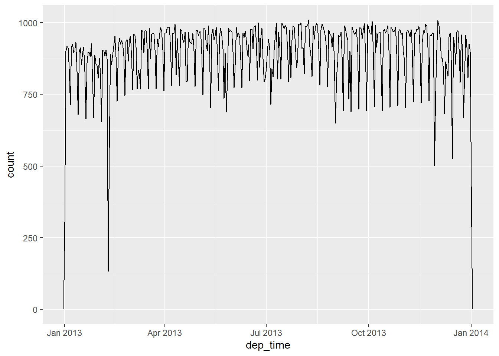

# In-class fun with dates, times, data viz and wrangling


```r
library("tidyverse")
library("lubridate")
library("nycflights13")
```


# Let's make sure we like and understand dates and times:

## Point of these questions?

-  Does every year have 365 days?
-  Does every day have 24 hours?
-  Does every minute have 60 seconds?

## Do these code chunks make sense:


```r
today()
#> [1] "2022-01-04"
now()
#> [1] "2022-01-04 09:01:47 EST"
```


```r
flights %>% 
  select(year, month, day, hour, minute) %>% 
  mutate(departure = make_datetime(year, month, day, hour, minute))
#> # A tibble: 336,776 x 6
#>     year month   day  hour minute departure          
#>    <int> <int> <int> <dbl>  <dbl> <dttm>             
#>  1  2013     1     1     5     15 2013-01-01 05:15:00
#>  2  2013     1     1     5     29 2013-01-01 05:29:00
#>  3  2013     1     1     5     40 2013-01-01 05:40:00
#>  4  2013     1     1     5     45 2013-01-01 05:45:00
#>  5  2013     1     1     6      0 2013-01-01 06:00:00
#>  6  2013     1     1     5     58 2013-01-01 05:58:00
#>  7  2013     1     1     6      0 2013-01-01 06:00:00
#>  8  2013     1     1     6      0 2013-01-01 06:00:00
#>  9  2013     1     1     6      0 2013-01-01 06:00:00
#> 10  2013     1     1     6      0 2013-01-01 06:00:00
#> # ... with 336,766 more rows
```


```r
make_datetime_100 <- function(year, month, day, time) {
  make_datetime(year, month, day, time %/% 100, time %% 100)
}

flights_dt <- flights %>% 
  filter(!is.na(dep_time), !is.na(arr_time)) %>% 
  mutate(
    dep_time = make_datetime_100(year, month, day, dep_time),
    arr_time = make_datetime_100(year, month, day, arr_time),
    sched_dep_time = make_datetime_100(year, month, day, sched_dep_time),
    sched_arr_time = make_datetime_100(year, month, day, sched_arr_time)
  ) %>% 
  select(origin, dest, ends_with("delay"), ends_with("time"))

flights_dt
#> # A tibble: 328,063 x 9
#>    origin dest  dep_delay arr_delay dep_time           
#>    <chr>  <chr>     <dbl>     <dbl> <dttm>             
#>  1 EWR    IAH           2        11 2013-01-01 05:17:00
#>  2 LGA    IAH           4        20 2013-01-01 05:33:00
#>  3 JFK    MIA           2        33 2013-01-01 05:42:00
#>  4 JFK    BQN          -1       -18 2013-01-01 05:44:00
#>  5 LGA    ATL          -6       -25 2013-01-01 05:54:00
#>  6 EWR    ORD          -4        12 2013-01-01 05:54:00
#>  7 EWR    FLL          -5        19 2013-01-01 05:55:00
#>  8 LGA    IAD          -3       -14 2013-01-01 05:57:00
#>  9 JFK    MCO          -3        -8 2013-01-01 05:57:00
#> 10 LGA    ORD          -2         8 2013-01-01 05:58:00
#> # ... with 328,053 more rows, and 4 more variables:
#> #   sched_dep_time <dttm>, arr_time <dttm>,
#> #   sched_arr_time <dttm>, air_time <dbl>
```

### Hadley says: "With this data, I can visualise the distribution of departure times across the year"

```r
flights_dt %>% 
  ggplot(aes(dep_time)) + 
  geom_freqpoly(binwidth = 86400) # 86400 seconds = 1 day
```



## The following code from the chapter is used.  Does it make sense?


```r
make_datetime_100 <- function(year, month, day, time) {
  make_datetime(year, month, day, time %/% 100, time %% 100)
}

flights_dt <- flights %>%
  filter(!is.na(dep_time), !is.na(arr_time)) %>%
  mutate(
    dep_time = make_datetime_100(year, month, day, dep_time),
    arr_time = make_datetime_100(year, month, day, arr_time),
    sched_dep_time = make_datetime_100(year, month, day, sched_dep_time),
    sched_arr_time = make_datetime_100(year, month, day, sched_arr_time)
  ) %>%
  select(origin, dest, ends_with("delay"), ends_with("time"))
```


```r
sched_dep <- flights_dt %>%
  mutate(minute = minute(sched_dep_time)) %>%
  group_by(minute) %>%
  summarise(
    avg_delay = mean(arr_delay, na.rm = TRUE),
    n = n()
  )
```

## What do these do: `floor_date()`, `round_date()`, and `ceiling_date()`?

## Try these

1. Look at the number of cancelled flights per day. Is there a pattern? Is the proportion of cancelled flights related to the average delay?


1. Which carrier has the worst delays? Challenge: can you disentangle the effects of bad airports vs. bad carriers? Why/why not? (Hint: think about `flights %>% group_by(carrier, dest) %>% summarise(n())`)


1. Use a good old visual aid to illustrate if/how how the average delay time changes over the course of a day. Your graph should answer, do flights get more late as the day goes on?


2. On what day of the week should you leave if you want to minimize the chance of a delay? How do you know? Use a bar chart to show the average delay for each day of the week.


3. Are early arrivals of flights caused more by scheduled flights that leave early or that make up time in the air?


